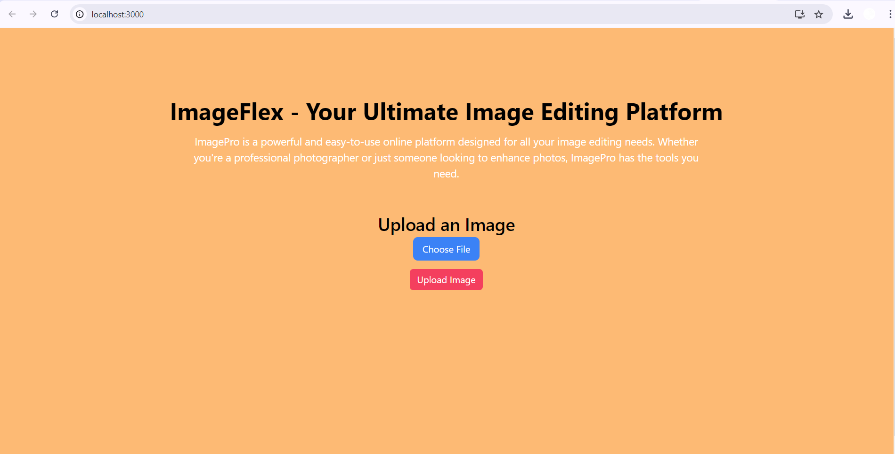
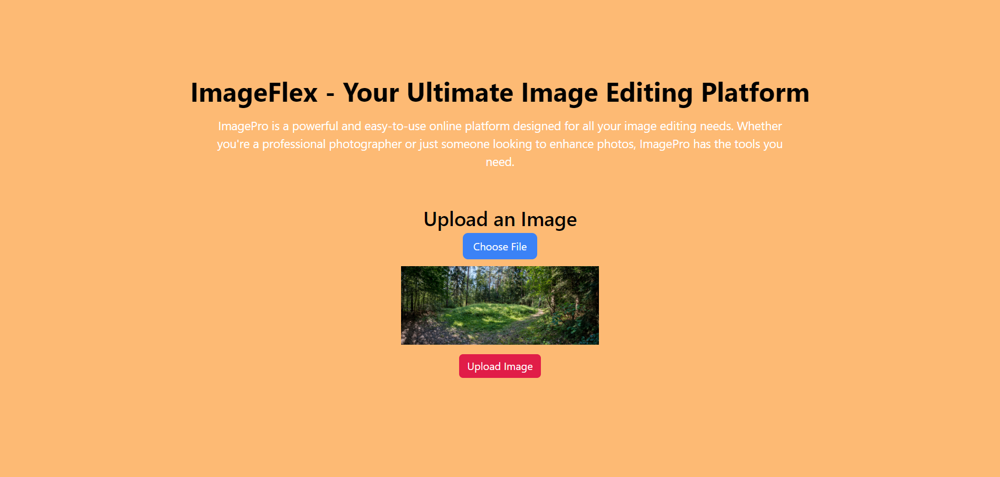
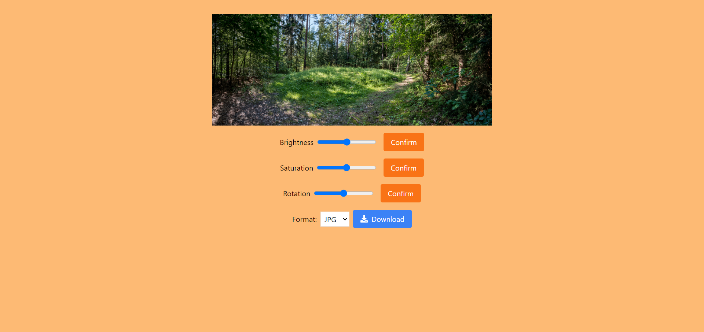
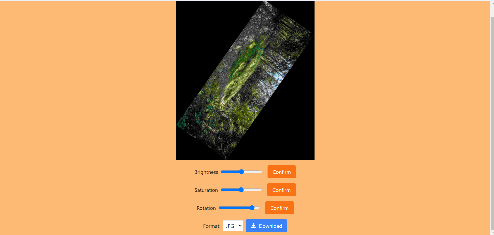

# ImageFlex-Fullstack-App

It is a Fullstack Project in which we can upload images. manipulate them e.g adjust saturation, brightness, cropping, rotation etc.

### Installation
- clone the repository
```
git clone https://github.com/mayank-gupta01/ImageFlex-Fullstack-App
```


# ImageFlex - Backend

## Overview

This backend API allows users to upload images, modify their properties (such as brightness and saturation), and retrieve the edited images. The system is optimized to handle image manipulation.

### Tech stack used :

Node.js, Typescript, Sharp (Node.js library used for image processing), Multer (used for file handling)

### installation 
- install dependecies
```
npm install
```

- start the backend server (running on PORT 8000)
```
npm start
```

### Features:

- Image Uplaod - User can upload image to the server.
- Image Editing - Supports brightness, saturation, cropping, rotation, conversion (png or jpg) and download image.
- Image Preview: Provides previews of manipulated images via API. Compressing the file for better and quick response of API.
- Singleton class use: Mapping of original file path to compress file path using singleton class. so only one occurence of class is implemented.
- Well documentation provided for every file and function.
- keeping good structure of repo for better debugging and understanding.

### API Endpoints:
#### 1. Upload Image
Endpoint: /upload   
Method: POST  
Description: Upload an image to the server.  
Request Parameters:
file (form-data): The image file to be uploaded.  
Response:  
200 OK: Image uploaded successfully, return the filePath used for further task.  
400 Bad Request: Invalid file or unsupported format.  


#### 2. Adjust Brightness of Image
Endpoint: /brightness
Method: POST  
Description: Adjust Brightness of image.   
Request Parameters: file path (which given as response in upload API) and brightness value (default: 50)  
Response:  
200 OK: Brightness adjusted successfully, return the preview of Image.  
400 Bad Request: Error.


#### 3. Adjust Saturation of Image
Endpoint: /saturation  
Method: POST  
Description: Adjust Saturation of image.   
Request Parameters: file path (which given as response in upload API) and saturation value (default: 50)  
Response:  
200 OK: Saturation adjusted successfully, return the preview of Image.  
400 Bad Request: Error.

#### 4. Adjust Rotation of Image
Endpoint: /rotation  
Method: POST  
Description: Adjust Rotation of image.   
Request Parameters: file path (which given as response in upload API) and rotation value (varies from -180 to 180) (default: 0)  
Response:  
200 OK: Rotation adjusted successfully, return the preview of Image.  
400 Bad Request: Error.

#### 5. Adjust Cropping of Image
Endpoint: /cropping    
Method: POST  
Description: Adjust Cropping of image.   
Request Parameters: file path (which given as response in upload API) and width and height value.  
Response:  
200 OK: Cropping adjusted successfully, return the preview of Image.  
400 Bad Request: Error.

<br>
<br>
<br>
<br>
<br>
<br>
<br>


# ImageFlex - Frontend

## Overview
This frontend application provides a user interface for uploading images, adjusting their brightness and saturation, and viewing the results in real-time. It interacts with a backend API to handle image processing and storage, ensuring a seamless user experience.

### Tech stack used :

React, Typescript, Axios (for making HTTP request), TailwindCSS

### installation
- install dependecies
```
npm install
```

- start the frontend server (running on PORT 3000)
```
npm start
```

### Features:

- Interactive and attractive UI
- Image Upload: User can upload Image by frontend which interact with backend to process the image. (compression & store)
- Real time editing: Adjust brightness, saturation, rotation with instant previews.
- Image Preview: View the edited image before saving or downloading.
- Confirmation Button: If user want to confirm current editing for each feature, click on confirm button.

<br>

### Some sights of Web Application


After selecting image


Edit Part


After Rotation


